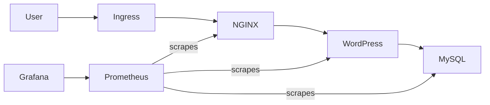

# Production-Ready WordPress Deployment on Kubernetes  
### Custom Docker Images • Helm • Nginx Reverse Proxy • MySQL • Prometheus • Alertmanager • Grafana

---

##  Overview

This project implements a **real production-style WordPress deployment** on Kubernetes using:

 Helm chart  
 Custom-built Docker images  
 Persistent storage  
 Nginx reverse proxy  
 Prometheus monitoring  
 Grafana dashboards  
Alertmanager alerts

The project teaches end-to-end DevOps — from infrastructure to observability.

---

---

## Architecture



---

---

##  Features

WordPress FPM deployed on Kubernetes  
MySQL backend  
OpenResty (NGINX + Lua) reverse proxy  
ReadWriteMany PVC for WordPress storage  
Prometheus scraping + kube metrics  
Grafana dashboards: CPU, memory, requests, 5xx errors  
Alerting support included  

---

---

##  Repository Structure

```
.
├── charts/
│   └── wordpress/
│       ├── Chart.yaml
│       ├── values.yaml
│       └── templates/
│           ├── deployment-mysql.yaml
│           ├── deployment-nginx.yaml
│           ├── deployment-wordpress.yaml
│           ├── pvc-mysql.yaml
│           ├── pvc-wordpress.yaml
│           ├── configmap-nginx.yaml
│           ├── service-nginx.yaml
│           ├── service-wordpress.yaml
│           └── service-mysql.yaml
├── docker/
│   ├── mysql/
│   ├── wordpress/
│   └── nginx-openresty/
└── docs/
    ├── metrics.md
    └── monitoring-setup.md
```

---

---

##  Prerequisites Checklist

Kubernetes cluster (Docker Desktop works)  
Helm installed  
kubectl installed  
Docker Hub account  
Git installed  

---

---

##  Step-by-Step Setup

---

### Step 1 — Clone Repository

```bash
git clone <repo-url>
cd <repo>
```

---

### Step 2 — Build Docker Images

```bash
docker build -t venoomm/wordpress:latest ./docker/wordpress
docker build -t venoomm/mysql:latest ./docker/mysql
docker build -t venoomm/nginx-openresty:latest ./docker/nginx-openresty
```

---

### Step 3 — Push Images

```bash
docker push <dockerhub-user>/wordpress:latest
docker push <dockerhub-user>/mysql:latest
docker push <dockerhub-user>/nginx-openresty:latest
```

---

---

## Deploy WordPress Stack using Helm

```bash
cd charts/wordpress
helm install my-release .
```

Verify:

```bash
kubectl get pods
kubectl get svc
kubectl get pvc
```

---

---

##  Access WordPress UI

```bash
kubectl port-forward svc/nginx-service 8080:80
```

Open browser:

http://localhost:8080

---

---

##  Monitoring Setup

### Step 1 — Add kube-prometheus-stack Helm repo

```bash
helm repo add prometheus-community https://prometheus-community.github.io/helm-charts
helm repo update
```

### Step 2 — Install monitoring stack

```bash
helm install monitoring prometheus-community/kube-prometheus-stack -n monitoring --create-namespace
```

---

---

##  Access Grafana

Get password:

```bash
kubectl get secret monitoring-grafana -n monitoring -o jsonpath="{.data.admin-password}" | base64 --decode
```

Port forward:

```bash
kubectl port-forward svc/monitoring-grafana 3000:80 -n monitoring
```

Open browser:

 http://localhost:3000  
Login: `admin / <password>`

---

---

##  Create Custom Dashboards

### Pod CPU

```
sum(rate(container_cpu_usage_seconds_total{namespace="default"}[2m])) by (pod)
```

### Pod Memory

```
sum(container_memory_usage_bytes{namespace="default"}) by (pod)
```

### Nginx Requests

```
sum(rate(nginx_ingress_controller_requests_total[1m])) by (status)
```

### Nginx 5xx Errors

```
sum(rate(nginx_ingress_controller_requests_total{status=~"5.."}[2m]))
```

Save dashboard as `WordPress Monitoring`.

---

---

##  Troubleshooting Guide

| Issue | Fix |
|------|-----|
| `CrashLoopBackOff nginx` | ConfigMap incorrectly mounted — fix mount path |
| WordPress page not loading | Use port-forward or external LB |
| Grafana “No Data” | Check Prometheus targets |
| Node exporter crash | Patch security context on Docker Desktop |

---

---

##  Cleanup

```bash
helm delete my-release
helm delete monitoring -n monitoring
kubectl delete ns monitoring
```

---

---

##  Future Enhancements

Horizontal Pod Autoscaler  
SSL termination  
Ingress Controller  
CI/CD deployment  

---

---

##  Maintainer

  Ravi kumar
📩 GitHub: RaviRaghuv

Feel free to fork, star ⭐ and improve!
